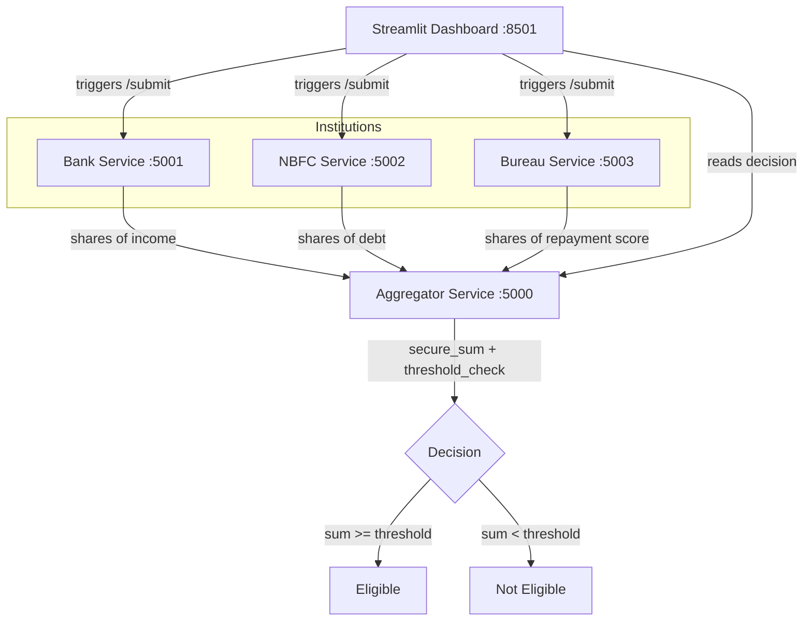

# FC-01 — Privacy-Preserving Financial Data Exchange

Built for **Project J.A.R.V.I.S.**, IGNITRRON'26 (Domain 05 — Fintech & Cyber)

## Team
<!-- TODO: fill in team name and member names -->
Team Name:
Members:

## Problem Statement
Financial institutions need to verify or analyse each other's customer data (loan checks, KYC, credit scoring) without transferring the raw underlying data. The core challenge is balancing data utility, verification capability, and privacy.

## Proposed Solution
Three simulated financial institutions — a **Bank**, an **NBFC**, and a **Credit Bureau** — each hold one private financial value about a shared customer (income, existing debt, repayment score respectively). Using a hand-rolled **additive secret-sharing MPC protocol**, they jointly compute a loan eligibility decision without any institution, and without the central aggregator, ever seeing another party's raw value.

This is not a wrapped crypto library — every line of the secret-sharing math is written from scratch and the team can explain and defend it directly.

## Key Features
- Custom additive secret-sharing engine (`core/secret_sharing.py`) — pure Python modular arithmetic, no external crypto/MPC library
- 3 institution microservices + 1 aggregator microservice, communicating over real HTTP
- Secure sum computed **position-wise across institutions** — the aggregator never reconstructs any single institution's value, only the joint total
- Configurable institution values for live demo of both Eligible and Not Eligible outcomes
- Interactive Streamlit dashboard that triggers the full protocol live and shows a **network-trace panel** — the literal share payloads that crossed the wire, proving no raw value was ever transmitted
- Unit-tested core: 7 passing tests covering split/combine round-trips, secure-sum correctness, threshold behavior, and share randomness sanity checks

## How It Works
1. Each institution calls `split(value)` → 3 shares such that `value = s1 + s2 + s3 (mod p)`. Any single share is statistically indistinguishable from a random number.
2. Each institution POSTs its 3 shares to the aggregator's `/receive-shares` endpoint.
3. Once all 3 institutions have reported in, the aggregator sums shares **position-wise across institutions** (never combining one institution's own 3 shares) via `secure_sum()`.
4. `threshold_check()` reconstructs the joint total from the summed shares and compares it to a threshold, returning **Eligible** or **Not Eligible**.

## System Architecture


## Technology Stack
- **Python 3.11**
- **Flask** — 4 microservices (bank, nbfc, bureau, aggregator)
- **Streamlit** — live demo dashboard
- **Requests** — HTTP calls between services
- No external crypto/MPC libraries — the secret-sharing math is entirely hand-written

## Database
None — this demo uses in-memory state on the aggregator for a single protocol round (reset via `/reset`).

## API Endpoints

**Each institution service** (`bank_service`, `nbfc_service`, `bureau_service`):
| Method | Endpoint | Description |
|---|---|---|
| GET | `/health` | Health check |
| POST | `/set-value` | Set the institution's private value, e.g. `{"value": 45000}` |
| POST | `/submit` | Split the private value into 3 shares and send to the aggregator |

**Aggregator service**:
| Method | Endpoint | Description |
|---|---|---|
| GET | `/health` | Health check |
| POST | `/reset` | Clear state for a fresh round |
| POST | `/receive-shares` | Receive one institution's 3 shares |
| GET | `/decision` | Get the current round's decision |

## Project Structure
```
fc01-privacy-preserving-exchange/
├── README.md
├── requirements.txt
├── core/
│   ├── secret_sharing.py
│   └── tests/test_secret_sharing.py
├── services/
│   ├── bank_service/app.py
│   ├── nbfc_service/app.py
│   ├── bureau_service/app.py
│   └── aggregator_service/app.py
└── dashboard/app.py
```

## Installation
```powershell
python -m venv .venv
.venv\Scripts\activate
pip install -r requirements.txt
```

## Environment Variables
None required — all ports and URLs are hardcoded to localhost for this demo (5000–5003 for services, 8501 for the dashboard).

## Running Locally
Open 5 terminals (all with `.venv\Scripts\activate` run first):
```powershell
python services\aggregator_service\app.py   # terminal 1
python services\bank_service\app.py         # terminal 2
python services\nbfc_service\app.py         # terminal 3
python services\bureau_service\app.py       # terminal 4
streamlit run dashboard\app.py              # terminal 5
```

## Deployment
<!-- TODO: not yet deployed -->
Live deployment pending.

## Usage
Open the Streamlit dashboard, adjust each institution's value if desired, click **"Run Secure Eligibility Check"**, and watch the protocol execute live: shares are generated, sent to the aggregator, and a joint Eligible/Not Eligible decision is returned — all visible in the network-trace panel.

## Future Scope
Explicitly out of scope for this hackathon build, left for future work:
- Shamir's threshold secret sharing (currently simple n-of-n additive sharing)
- Secure comparison via garbled circuits
- A selective-disclosure / zero-knowledge layer
- Running the 3 share-holder roles on genuinely non-colluding separate servers (this demo simulates all three locally to demonstrate the protocol math)

## Team
Sastika M
Prakalya SK